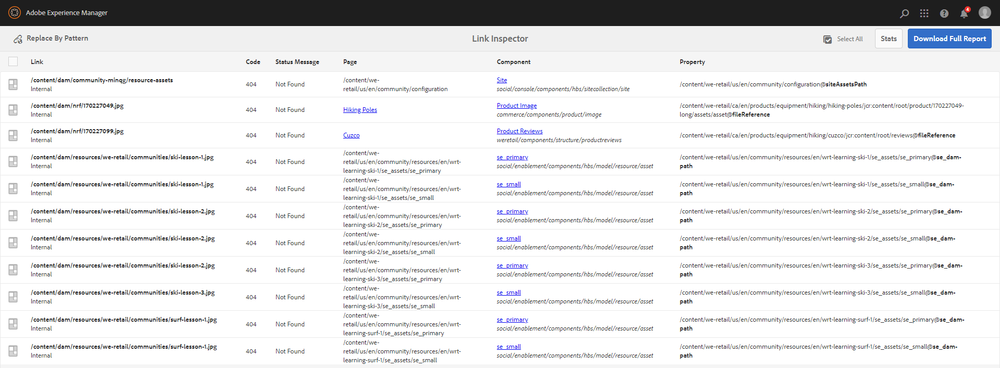
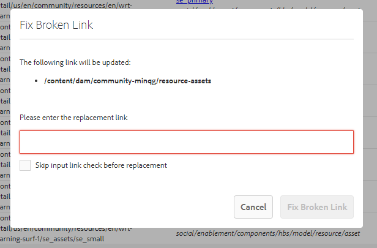
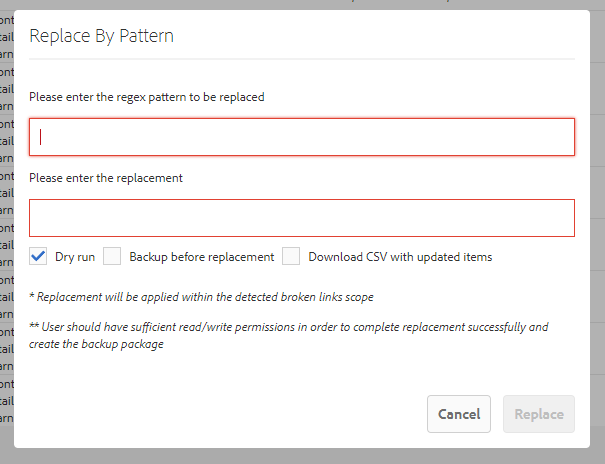

# EToolbox Link Inspector

**EToolbox Link Inspector** is a tool for Adobe Experience Manger (AEM) that collects broken links (external/internal) under the specified content path. The tool generates a comprehensive report with the detailed information about broken links and provides content managers with a possibility to fix batches of broken links via UI dialog.

## Description
**EToolbox Link Inspector** gathers the following data in relation to broken links:
- link href
- link type
- http status code
- status message
- reference to the page containing the link, including the page's title and location
- reference to the component containing the link, including the component's title, resource type and location
- reference to the property containing the link, including the property's name and location

The primary focus is detection of broken links on an Author instance and correcting them by content managers before going to live.

The tool provides a possibility to fix broken links (single as well as batches) via TouchUI based dialogs:

Besides, there is a broad set of configurable options for report generation allowing to set up content and links filtering in order to have a more precise inspection.

See [project's Wiki](#) for more details.

## System Requirements

AEM 6.5 | AEM 6.4 | Java SE | Maven
---------|---------|---------|---------
6.5.5.0+ | 6.4.8.1+ | 8, 11 | 3.3.9+

## Installation
The tool can be installed using the package or via building the project.

### Package 
1. Get the latest package version from https://github.com/exadel-inc/etoolbox-link-inspector/releases
2. Install the package _**etoolbox-link-inspector.all-XX.zip**_ using the _Package Manager_
3. Ensure that the bundle **_EToolbox Link Inspector - Core (etoolbox-link-inspector.core)_** is in _Active_ state.

### How to build

To build all the modules and deploy the `all` package to a local instance of AEM, run in the project root directory the following command:

   `mvn clean install -PautoInstallSinglePackage`

## Getting Started
After the [Installation](#Installation) steps are completed it is necessary to:
1. Set up the cron expression and enable the scheduler task at _/system/console/configMgr/com.exadel.etoolbox.linkinspector.core.schedulers.DataFeedGenerationTask_, see the [Scheduled Data Feed Generation](#) section in Wiki for more details;
2. Set up the root path for searching broken links at _/system/console/configMgr/com.exadel.etoolbox.linkinspector.core.services.data.impl.GridResourcesGeneratorImpl_, see the [Data Filtering](#) section in Wiki for more details.

The report generation will start in accordance with the configured cron. As soon as the data feed is generated, the results will be available at **_Tools > EToolbox > Link Inspector_**
(_<YOUR_AEM_INSTANCE>/tools/etoolbox/link-inspector.html_)

Check out the [Data Filtering](#) section in Wiki for more filtering options.

## Documentation

You can find the documentation [in the project's Wiki](#).  

## Contributing

Contributions are what make the open source community such an amazing place to be learn, inspire, and create. Any contributions you make are **greatly appreciated**.

1. Fork the Project
2. Create your Feature Branch (`git checkout -b feature/AmazingFeature`)
3. Commit your Changes (`git commit -m 'Add some AmazingFeature'`)
4. Push to the Branch (`git push origin feature/AmazingFeature`)
5. Open a Pull Request

## License

This project is available under the [Apache License, Version 2.0](https://opensource.org/licenses/Apache-2.0).